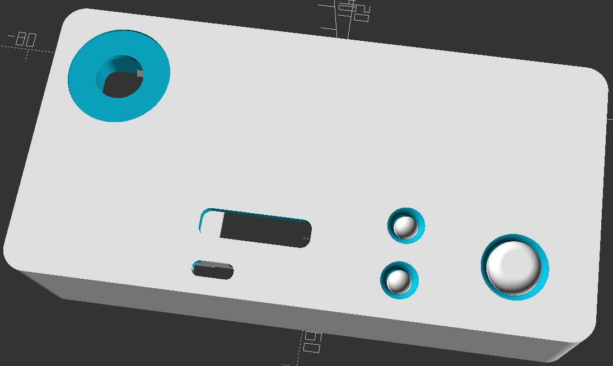
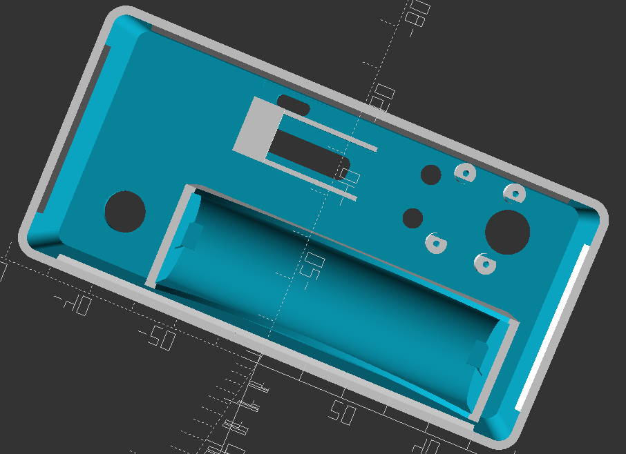

# Ohm Meter
# A 3D Printed Ohm Meter for the DNA60 Chipset from [Evolv](https://evolvapor.com)
This repository will contain the OpenSCAD files as well as STL/AMF exports of the parts needed to actually print the mod yourself.

The ohm meter will fit a 30mm atomizer without overhang. 

It was designed to be easy to assemble and to be able to be printed without much support material.

That said you will likely need to support the 510 recess, and possibly the part that holds in the screen, depending on how well your printer can bridge.

The depth of the 510 recess may need to be adjusted depending on your printers calibration and tolerances. 

You can adjust its depth in the OpenSCAD file on line 572. 

`translate([-45,-17,29.75])` 

Change the last value, 29.75. Decreasing it will make the 510 recess larger, increasing it will make it smaller.

There are currently 2 OpenSCAD files for the model. One with the DNA60 model and one without. The DNA60 model is large and has many complex polyhedrons which greatly increase compile and render time. I recommend using the file without the DNA60 model. The one with the DNA model was only used to aid in the alignment of the model.

My focus was on keeping the number of parts down while keeping the outside of the mod as clean as possible.

Currently you only need to print 3 files.

- [The Main Body](Completed_Files/DNA60_OhmMeter.stl)
- [The Fire Button](Completed_Files/Fire_Button.stl)
- [The Up & Down Buttons](Completed_Files/Up_Down_Buttons.stl)

You will find these files in the [Completed Files](Completed_Files) directory.

## Parts list:
| Part  | Source |
| ------------- | ------------- |
| Evolv DNA60 Large Screen ( With USB Charge Board )  | [Evolv DNA60 Large Screen ( With USB Charge Board )](https://www.evolvapor.com/products/dna60)  |
| Source V3 M10 510 Connector ( 22mm Plain or VFlat ) | [Source V3 M10 510 Connector](https://www.stealthvape.co.uk/product/source-v3-m10-510-connector/) |
| Screws ( M1.6 × 0.35 mm )                           | [Metric 18-8 Stainless Steel](https://www.mcmaster.com/92010A812) |
| Keystone Part #1017-1 ( Positive Battery Contact )  | [Keystone Part #1017-1 ( Positive Battery Contact )](https://www.keyelco.com/product.cfm/product_id/4043/)  |
| Keystone Part #5223 ( Negative Battery Contact )    | [Keystone Part #5223 ( Negative Battery Contact )](https://www.keyelco.com/product.cfm/product_id/910/)  |
| Red 16awg Silicone Wire                             | [Red 16awg Silicone Wire](https://hobbyking.com/en_us/turnigy-high-quality-16awg-silicone-wire-1m-red.html)  |
| Black 16awg Silicone Wire                           | [Black 16awg Silicone Wire](https://hobbyking.com/en_us/turnigy-high-quality-16awg-silicone-wire-1m-black.html)  |
| Red 24awg Silicone Wire                             | [Red 24awg Silicone Wire](https://hobbyking.com/en_us/turnigy-high-quality-24awg-silicone-wire-1m-red.html)  |
| Black 24awg Silicone Wire                           | [Black 24awg Silicone Wire](https://hobbyking.com/en_us/turnigy-high-quality-24awg-silicone-wire-1m-black.html)  |
| Red 30awg Silicone Wire                             | [Red 30awg Silicone Wire](https://hobbyking.com/en_us/turnigy-high-quality-30awg-silicone-wire-5m-red.html)  |
| Black 30awg Silicone Wire                           | [Black 30awg Silicone Wire](https://hobbyking.com/en_us/turnigy-high-quality-30awg-silicone-wire-5m-black.html)  |

